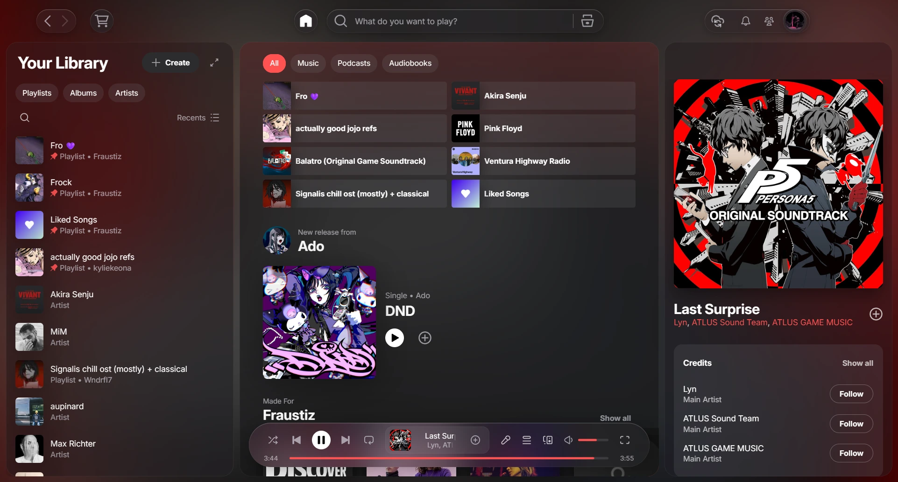
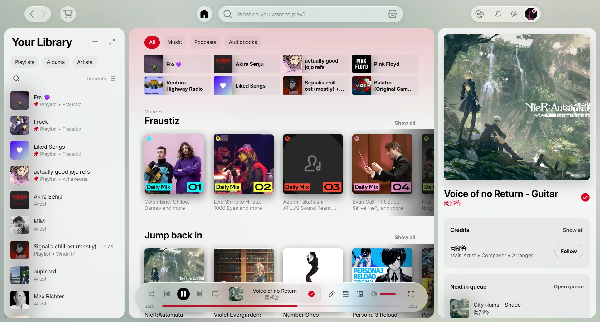
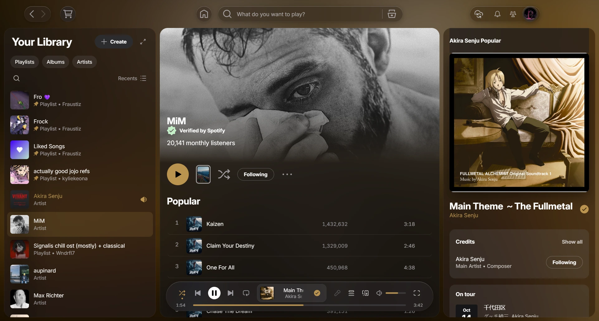
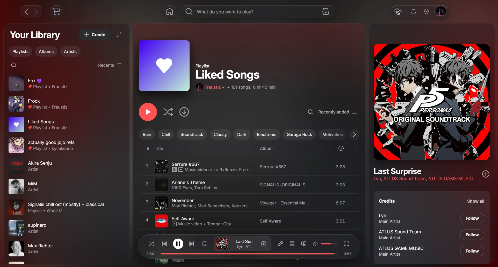
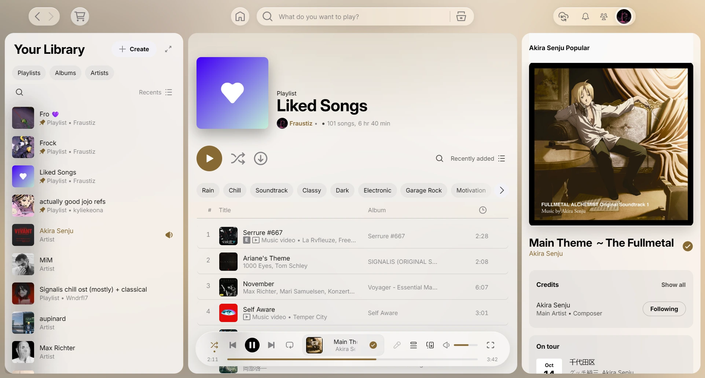
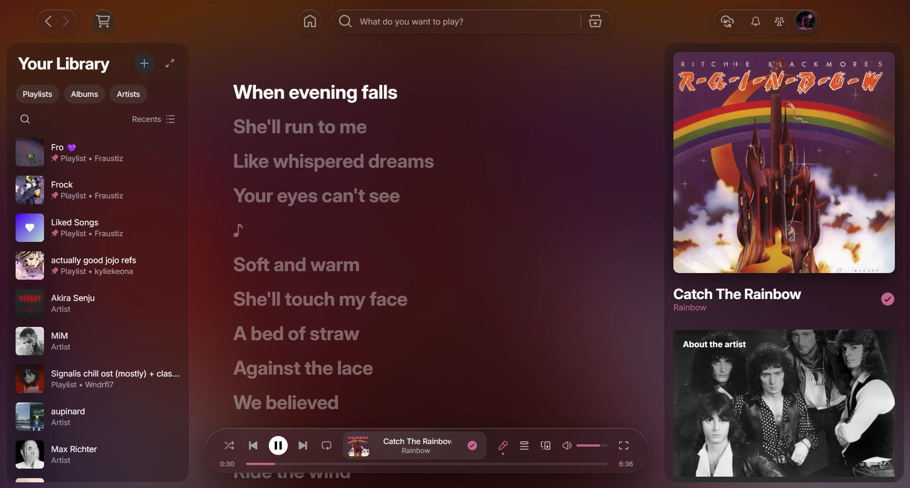
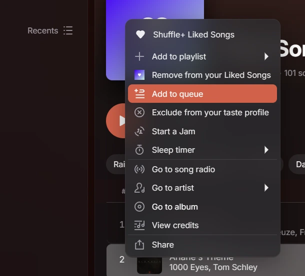

# LiquidMusic

A [Spicetify](https://spicetify.app) theme inspired by iOS 27 and Apple Music: frosted glass panels, a floating
player, and an accent colour taken from whatever is playing.



## Features

- **Glass everywhere.** The library, the side panel, the toolbar, menus and the search field are frosted glass
  over a blurred copy of the current artwork, so the whole window takes on the colours of the song.
- **Colour from the artwork.** The accent (buttons, progress bar, highlights, links) is picked from the album cover
  and adjusted until it reads at 4.5:1 or better on the theme's surfaces. Panels thicken on busy covers so
  secondary text stays legible.
- **Floating player.** The playback bar becomes a pill with an LCD-style track display. On narrow windows it drops
  secondary controls first, so the title always has room.
- **Light, dark or automatic.** The `auto` scheme follows your system setting and switches live.
- **Accessibility.** Reduced motion, reduced transparency and increased contrast system settings are respected:
  animations calm down, and glass turns into solid surfaces.

## Screenshots

| | |
|---|---|
|  |  |
|  |  |
|  |  |

## Install

### From the Marketplace

Open the **Marketplace** in Spotify, go to **Themes**, search for **LiquidMusic** and install it. Pick `auto`, `dark`
or `light` from the colour scheme menu at the top of the Marketplace.

### Manually

1. Copy the `LiquidMusic` folder into your Spicetify `Themes` folder:
   - Windows: `%APPDATA%\spicetify\Themes`
   - macOS and Linux: `~/.config/spicetify/Themes`

   (`spicetify path userdata` prints the exact location.)
2. Select the theme and turn on the options it needs:

   ```sh
   spicetify config current_theme LiquidMusic color_scheme auto
   spicetify config inject_css 1 replace_colors 1 inject_theme_js 1
   spicetify apply
   ```

`inject_theme_js` is required: the dynamic accent, the artwork backdrop and the automatic light/dark switch run in
the theme's script.

### Colour schemes

| Scheme | |
|---|---|
| `auto` | Follows your system's light or dark setting (default) |
| `dark` | Always dark |
| `light` | Always light |

Change it with `spicetify config color_scheme dark`, then `spicetify apply`.

## Font

The theme uses [Inter](https://rsms.me/inter/), loaded from Google Fonts when Spotify starts. If it can't load,
text falls back to SF Pro, Segoe UI Variable, then your system font.

## Compatibility

Built and tested with Spicetify 2.45.1 and Spotify 1.3.0 on Windows 11. Spotify changes its interface often; if
something looks off after an update, please open an issue with a screenshot and your Spotify version.

## Credits

Inspired by Apple's design for iOS and Apple Music. Not affiliated with Apple or Spotify.
Inter is designed by Rasmus Andersson and released under the SIL Open Font License.
